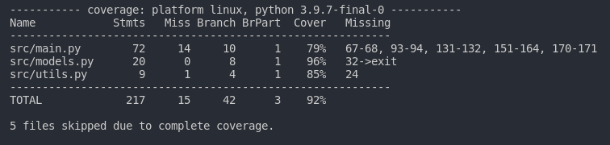

# exchangePortfolioAPI
Simple API for custom investing portfolio watch list.

To see a full list of the API methods and endpoints please refere to the API Documentation [here](docs/api_documentation.md).

# Prerequisits
A Yahoo Finance API Key is needed to use this project, one can be obtained here [Link](https://rapidapi.com/apidojo/api/yh-finance/)

1. Copy the `.env` file example
~~~
cp .env.example .env
~~~
2. Open the .env file and replace the value of `YH_FINANCE_API_KEY` with your Yahoo Finance API Key
```env
YH_FINANCE_API_KEY=[ YOUR_YAHOO_FINANCE_API_KEY ]
```

# Run the project with Docker
A docker-compose file was created to run both services [API, DynamoDB] and can be run with the following command:
```bash
docker-compose up

# Detached mode
docker-compose up -d
```

# Run the project in local

1. Start the local DynamoDB Service
~~~
docker-compose up -d dynamodb-local
~~~
2. Install the requirements
~~~
pip install requirements.txt
~~~
3. Start the fastAPI server
~~~
cd src
uvicorn main:app --reload --port 5000
~~~

## Validate code linter
~~~
cd src
flake8
~~~

## Run tests
To run tests and coverage report just use the pytest command
~~~
pytest
~~~
Coverage for pytest is installed configure, when running tests you'll get a report on the console as this one



# Deployment steps
1. Create the Lambda layer package with the following command
~~~
docker run -v "$PWD":/var/task "public.ecr.aws/sam/build-python3.9" /bin/sh -c "pip install -r requirements.txt -t python/lib/python3.9/site-packages/; exit"
~~~
2. Create a .zip file archive for your layer
~~~
zip -r exchangePortfolioAPILayer.zip python > /dev/null
~~~
3. Update the layer on AWS [Reference](https://aws.amazon.com/premiumsupport/knowledge-center/lambda-layer-simulated-docker/)

4. Create a `.zip` file with your code
~~~
zip -r exchangePortfolioAPI.zip src -x '*__pycache__*' '*tests*' '*tox.ini'
~~~
5. Create a lambda service on AWS services with the exported code.